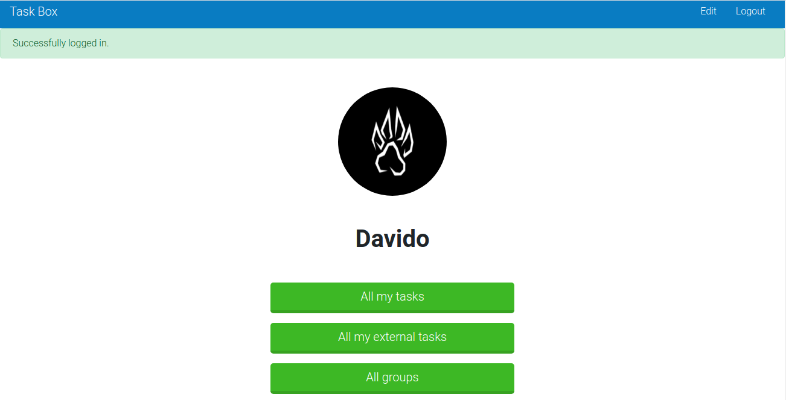

<br />
<p align="center">
  <h1 align="center"> Task APP</h1>
 
  <p align="center">
    A Ruby on Rails application
    <br />
    <br />
    <a href="https://stormy-ravine-81598.herokuapp.com/">View Demo</a>
    ·
    <a href="https://github.com/kobiyoyo/TaskApp/issues">Report Bug</a>
    ·
    <a href="https://github.com/kobiyoyo/TaskApp/issues">Request Feature</a>
  </p>
  
</p>


## Description
This is an app that is used for creating different groups and adding your tasks to these groups, the tasks include hours spent, which is a great tool to track and organize your time.


## Built With
- Ruby 
- Ruby on Rails
- Bootstrap 4
- Bullet
- Rubocop
- PostgreSQL

## Features
- A user can signup/login
- A user can create, delete, edit groups of tasks.
- A user can create, delete, edit tasks.

## Future features
* User can create a timer for each task.
* Users can add description to task.
* Logout after 5 minutes of inactivity


## Environment
- Ruby on Rails version 6.0
- [Bootstrap-sass](https://www.rubydoc.info/gems/bootstrap-sass/3.3.6) is a Sass-powered version of Bootstrap 3, ready to drop right into your Sass powered applications version 3.3.7
- Puma: A Ruby Web Server Built For Concurrency version '3.9.1'

## Getting started
> To get started with the app, clone the repo and then install the needed gems:

```
$ bundle install --without production
```

> Next,create & migrate the database:
```
$ rails db:create

$ rails db:migrate
```

> Run the app in a local server:

```
$ rails server
```
> Finally, run the test suite to verify that everything is working correctly:

```
$ rspec
```
> You can then drop into rails console to explore the models

```sh
$  rails c
```
## Live version

[Demo](https://stormy-ravine-81598.herokuapp.com/)

## Authors

👤 **Adama Chubiyojo Desmond**

-  [Github](https://github.com/kobiyoyo)
-  [Twitter](https://twitter.com/_kobiyoyo)
-  [Linkedin](https://www.linkedin.com/in/chubiyojo-adama/)
-  [Email](mailto:adamachubi@gmail.com)


## 🤝 Contributing

Contributions, issues and feature requests are welcome!<br />Feel free to check [issues page](https://github.com/kobiyoyo/TaskApp/issues).

1. Fork it (https://github.com/kobiyoyo/TaskApp/fork)
2. Create your working branch (git checkout -b [choose-a-name])
3. Commit your changes (git commit -am 'what this commit will fix/add')
4. Push to the branch (git push origin feature/[feature-name])
5. Create a new Pull Request

## Show your support

Give a ⭐️ if you like this project!


## 📝 License

This project is [MIT](./LICENSE) licensed.
